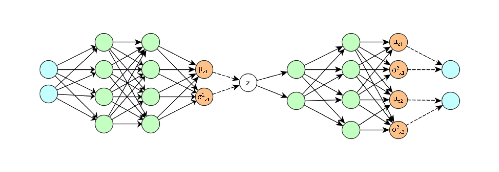

These are notebook are explaining the variational autoencoder (vae) described in Kingma&Welling [[1312.6114]](https://arxiv.org/abs/1312.6114)

Further details are given in a talk: https://home.zhaw.ch/~dueo/bbs/files/vae.pdf

* [vae_demo_-2D.ipynb](vae_demo_-2D.ipynb) is a toy example reproducing a two dimensional distribution from a one dimensional latent space
* [vae_demo.ipynb](vae_demo.ipynb) reproduces the MNIST-Digits from a two dimensional latent space
